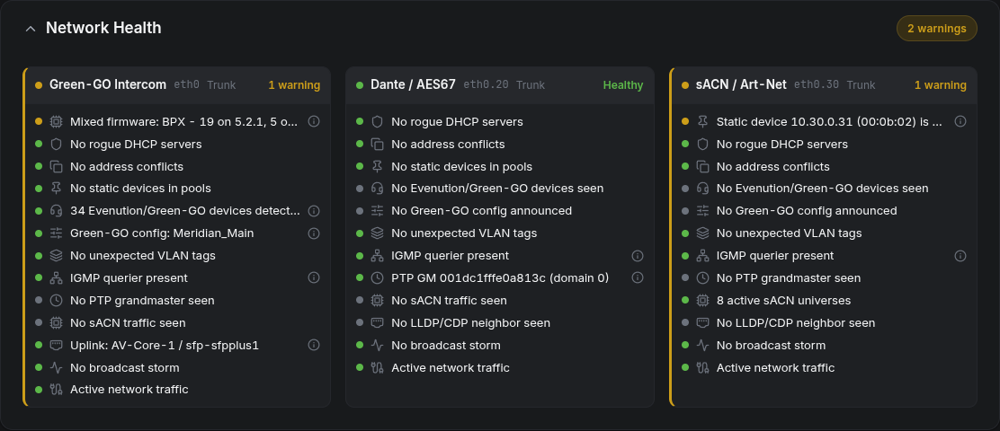

# ggo-kea-dhcp

[](https://github.com/lampensau/ggo-kea-dhcp/actions/workflows/ci.yml)
[](https://github.com/lampensau/ggo-kea-dhcp/releases/latest)
[](LICENSE)

A DHCP appliance for Green-GO intercom networks. It runs on a Raspberry Pi, drives an [ISC Kea](https://www.isc.org/kea/) DHCP4 server, and is operated entirely through a web UI. Built for show sites: no internet required, no Linux administration required, survives power cycles on its own.


## Why

On most show networks, DHCP is whatever the nearest managed switch happens to offer: a checkbox feature that hands out addresses in whatever order devices ask, keeps its lease table to itself, and treats a multi-channel station, a beltpack and someone's laptop identically. Rigs that ride on existing infrastructure, such as a venue or campus network, have even less say in who gets what. Either way, when addressing goes wrong mid-show, the DHCP server is a black box.

This appliance replaces that with a dedicated DHCP server that understands the hardware it serves. Green-GO device families each get their own address range, so an address tells you what kind of device you are looking at, and the appliance watches the network it serves instead of keeping quiet. Configuration is a browser form, not a config file, and the whole setup can be backed up to a single file and restored onto a spare Pi.

## What it does

- Runs and manages a Kea DHCP4 server; every setting is edited via the web UI
- Pool presets that recognize Green-GO device families automatically and give each family a guaranteed address range, with beltpacks taking the remainder; further presets for Dante/AES67, sACN/Art-Net and custom networks
- Serves a flat network or multiple tagged VLANs on one trunk
- Lease table with live search and release; static reservations with bulk import
- Port pinning: fix a device to its current address based on the connected switchport
- Full-appliance backup and restore in one file, including on the factory screen for bare-metal recovery
- Audit log of every configuration change and system event, with actor and result
- Fully offline: all assets are embedded, nothing is fetched at runtime

## Network health monitoring

While serving DHCP, the appliance passively listens to the network and warns about the things that could break a show:

- a rogue DHCP server answering next to it
- duplicate IP addresses
- a device with a static address sitting inside a dynamic pool
- VLAN traffic arriving where it should not
- Green-GO devices stuck on link-local addresses or running without a lease
- multiple Green-GO configurations active on the same segment
- mixed firmware within a Green-GO device family
- PTP grandmaster changes and instability (Dante, AES67)
- broadcast storms and spanning-tree topology changes
- LLDP/CDP switch neighbors, IGMP queriers and sACN activity, so you can see what the network actually looks like from the appliance's port

Monitoring is strictly read-only. It captures and reports; it never changes the DHCP configuration or touches the network. Findings appear on the dashboard and land in the audit log.



## Requirements

- Raspberry Pi with a 64-bit (arm64) Debian-based OS, such as Raspberry Pi OS
- Wired ethernet (eth0) into the network the appliance will serve
- Built-in WiFi is used for a temporary onboarding access point; not needed after setup
- Internet access during installation only

> [!WARNING]
> Once activated, the appliance takes over eth0 and becomes `10.0.0.1` on its network. Plan for it to be the DHCP server, not a guest on an existing one.

## Quick install

On a freshly flashed Pi, run:

```sh
curl -fsSL https://raw.githubusercontent.com/lampensau/ggo-kea-dhcp/main/install.sh | sudo bash
```

Then:

1. Reboot. The appliance activates on first boot and raises a WiFi onboarding access point.
2. Join the `GGO-DHCP-Onboarding` WiFi network, or plug your laptop into the same network as eth0.
3. Open `https://ggo-kea-dhcp.local/` and accept the self-signed certificate.

See [Installation](docs/install.md) for details, offline installs and upgrades, and [First boot](docs/first-boot.md) for all the ways to reach the appliance.

## Documentation

| Page | Covers |
| --- | --- |
| [Installation](docs/install.md) | From blank Pi to installed appliance; upgrades; uninstall |
| [First boot](docs/first-boot.md) | Reconnecting after activation; creating the administrator |
| [Setup wizard](docs/setup-wizard.md) | Network profile, scopes and pool presets; applying the configuration |
| [Address pools](docs/pools.md) | How pools work and how to edit the pool plan |
| [Day-to-day operation](docs/operating.md) | Dashboard, leases, reservations, port pinning, audit log, settings |
| [Network health](docs/network-health.md) | What each detector means and what to do about its warnings |
| [Backup, restore and reset](docs/backup-restore.md) | Backups, the three restore paths, routine vs factory reset |
| [Troubleshooting](docs/troubleshooting.md) | Symptom-first recovery, including when the web UI is unreachable |

## How it works

The web application is the control plane: it stores profiles, scopes and users in a local SQLite database, renders the Kea DHCP4 configuration from them, and reloads Kea over its control socket. Host reservations live in a [MariaDB](https://mariadb.org/) database that Kea reads directly. The appliance moves through a small lifecycle (factory, onboarding, active), and after any crash or power cut it reconciles itself back to the configured state on boot. Network monitoring runs alongside as a passive listener and never writes to any of this.

## Security

The web UI is served over HTTPS with a locally generated certificate; the appliance is designed to be reachable only from the network it serves. Sessions expire after inactivity, and login attempts are throttled. To report a vulnerability, see the [security policy](.github/SECURITY.md); please do not open a public issue.

## Contributing

Bug reports and pull requests are welcome. See [CONTRIBUTING.md](CONTRIBUTING.md) for the build setup and expectations.

## License

[MIT](LICENSE)
