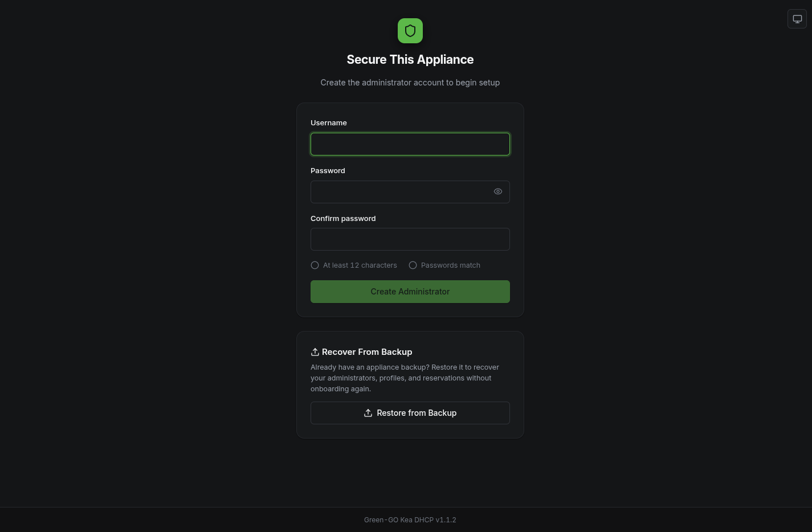

# First boot

After [installation](install.md) and the reboot, the appliance activates: it takes over eth0 as `10.0.0.1`, starts serving DHCP there, and raises a temporary WiFi access point for onboarding. Your old SSH session over eth0 is gone; this page is about getting back in through the front door.

## Reaching the appliance

Two ways in, both ending at the same web UI. This table is the canonical address reference for the whole guide.

| Path | How to connect | Then open |
| --- | --- | --- |
| WiFi onboarding AP | Join the `GGO-DHCP-Onboarding` network (the default name; changeable later in Settings) | `https://ggo-kea-dhcp.local/` or `https://172.31.255.1/` |
| Wired (eth0) | Plug your laptop into the same switch or cable as the Pi's eth0; you will get a `10.0.0.x` address automatically | `https://ggo-kea-dhcp.local/` or `https://10.0.0.1/` |

> [!TIP]
> `https://ggo-kea-dhcp.local/` is the address worth remembering: it keeps working later, when the appliance moves to its real show address. It relies on mDNS, which most laptops resolve out of the box; if it does not resolve on your machine, use the IP for the path you are on.

The onboarding access point only exists until setup is complete. Once the appliance is active, the access point is gone and the wired network is the way in; WiFi then serves only the optional internet uplink.

## The certificate warning

The web UI is served over HTTPS with a certificate the appliance generates itself, since a show network has no public certificate authority. Your browser will warn about it on first visit; choosing "proceed" or "accept the risk" is the expected step. If you prefer a warning-free setup, the appliance's local CA certificate can be imported into your system trust store, but this is optional.

## Create the administrator

The first page you see is the factory screen: create the administrator account that owns this appliance.

> [!IMPORTANT]
> Pick a password you can produce at the venue. There is no password reset, and even a factory reset asks for the current password first. A lost password means re-imaging the SD card, creating a fresh administrator, and then [restoring a backup](backup-restore.md) without its administrator section - so keep a backup off the box.

After the account is created, the appliance moves on to the [setup wizard](setup-wizard.md), where you define the network it will serve.

## Restoring instead of setting up fresh

If this Pi is replacing another appliance, or you are recovering from a failure, the factory screen also offers a restore from backup. Uploading a backup file brings back the administrator accounts, the network configuration and all reservations in one step, and the appliance applies the restored configuration immediately. See [Backup, restore and reset](backup-restore.md).

## If the appliance did not take over eth0

When activation fails, the appliance deliberately stays a normal DHCP client on your LAN so it remains reachable over SSH. If there is no `GGO-DHCP-Onboarding` network and nothing answers on `10.0.0.1`, see [Troubleshooting](troubleshooting.md).

## Next

Continue with the [setup wizard](setup-wizard.md).
