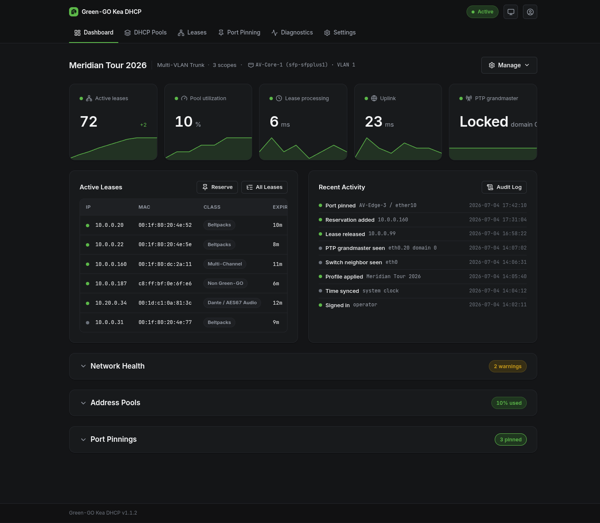
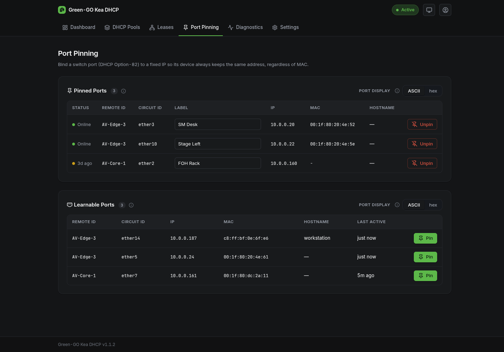

# Day-to-day operation

Once a profile is applied, the appliance mostly runs itself. This page is a tour of what you look at and touch during a show: the dashboard, leases and reservations, port pinning, the audit log and settings.

## Dashboard

The dashboard is a live console; everything on it updates over a persistent connection without reloading the page.

At the top, stat tiles with sparklines track the appliance's vitals over the last quarter hour or so: lease activity, pool utilization, DHCP responsiveness, uplink reachability, and PTP clock health when a grandmaster is visible. Below them:

- the network health card, one sub-card per served interface, showing what the passive monitor sees (see [Network health](network-health.md)); anything that needs attention there (a rogue DHCP server, a duplicate address) also raises the error/warning count on the header's status pill
- recent activity, active leases and port pinnings cards for a quick glance without leaving the page

The header line names the active profile and, when the switch announces itself via LLDP, shows which switch and port the appliance is plugged into: a "you are here" for the rack.

The Manage menu on the dashboard is where the bigger operations live: editing the configuration and its pools, creating a new configuration, and switching between saved profiles. The reset and power controls live in Settings.

## The backend health banner

Every page shares an always-on alert region for the two backends the appliance depends on:

- **DHCP server down** is an error: devices stop getting addresses. The banner clears itself the moment the server answers again; if it does not, [Troubleshooting](troubleshooting.md) has the recovery steps.
- **Reservation database down** is a warning: dynamic leases keep serving, but reservations and port pinning are unavailable until it returns. The appliance reconnects on its own.

Both transitions are recorded in the audit log with timestamps, which is useful when reconstructing what happened during a show.

## Leases and reservations

The Leases page shows every device the appliance knows about: active leases and client reservations together, plus any device spotted on a pool address while it awaits a DHCP renewal. The list is searchable live by IP, MAC, hostname or device class. Each row shows what the device is and how it got its address, with badges marking reserved addresses and port-pinned devices. A presence dot shows whether the device currently answers on the network, so a lease that outlived its unplugged device is easy to spot.

From a lease row you can:

- **Reserve** the device's current address, so this MAC always gets this IP
- **Release** the lease, forcing the device to ask again (useful after moving a device between pools)

Reserve a Client IP creates a reservation by hand for a device that is not on the network yet, and Import CSV adds reservations in bulk; imports are additive and never delete existing entries.

> [!NOTE]
> A device pinned to a switch port shows its pin on the Leases page but is managed on the Port Pinning page; its address follows the port, not the MAC.

## Port pinning

Port pinning fixes an address to a physical switch port rather than to a device. Whatever is plugged into that port gets that address, so you can swap a broken beltpack and the replacement inherits the position's identity. It requires a managed switch that inserts DHCP Option-82 relay information; without one, the page explains what is missing.

The Learnable Ports table fills up on its own as devices request addresses through Option-82-tagged ports. Pinning a port takes its current address and gives the port a label ("SM Desk", "Stage Left"); pinned ports then show live status in the table above. Port identities are raw switch data; the ASCII/hex toggle changes how they are displayed, not what is stored.

Use reservations when the device matters ("this beltpack"), pins when the position matters ("whatever is at the SM desk").

## Diagnostics and the audit log

The Diagnostics page has two halves. The prerequisite checks re-run on every load and probe everything the appliance depends on: the DHCP server, its hook libraries, the databases, the privileged tools and the capture permissions. Green across the board is the expected state; see [Troubleshooting](troubleshooting.md) for what to do when it is not.

Below the checks sits the audit log, the appliance's flight recorder: every configuration change, login, system event and monitor finding, with actor, timestamp and result. Failed actions are recorded alongside successful ones, with the reason. When someone asks "what changed at 20:14", this is where you look.

The status pill in the page header is the shortcut in: it shows the appliance state plus a live error/warning count, and clicking it jumps straight to the latest alert in the log.

## Settings

Settings collects the appliance-wide knobs:

- **WiFi Uplink** - the upstream WiFi credentials used for internet routing
- **Onboarding Network** - the management address and access point name/passphrase the box will use after its next factory reset, so recovery comes up the way you want
- **DHCP Defaults** - the default lease lifetime and DNS servers handed to every scope; individual scopes can override them. Shorter leases make pool changes and reservations take effect sooner, at the cost of more renewal traffic.
- **Backup and Restore** - see [Backup, restore and reset](backup-restore.md)

Your own username and password are not appliance settings: they are set once when you create the administrator at first boot, and changed later from the account menu at the right end of the header (the person icon) once the appliance is active, where the Account dialog asks for your current password before saving.

The running appliance version is shown here too; include it when reporting an issue.

## Reboot, shutdown and reset

The danger zone at the bottom of Settings holds the power and reset controls: a clean reboot (DHCP is unavailable for about a minute; the page reconnects on its own) and shutdown (the box stays off until physically power-cycled). Always shut down from here rather than pulling power; the databases on the SD card appreciate it. The two reset levels next to them are covered in [Backup, restore and reset](backup-restore.md).
