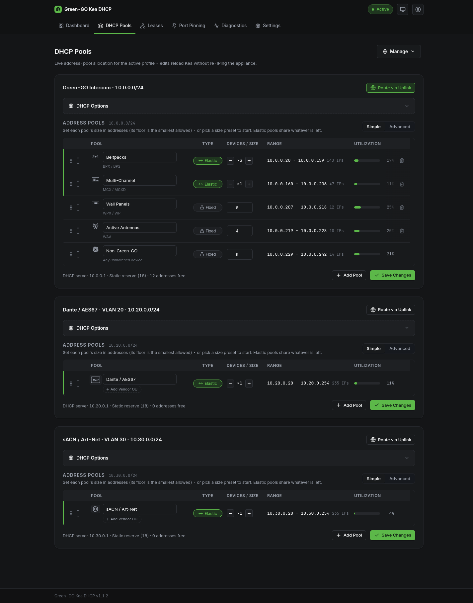

# Address pools

Every scope serves its addresses from a pool plan: an ordered list of pools, each with a type, a size and a rule for which devices land in it. The same editor appears inside the [setup wizard](setup-wizard.md) and on the Pools page of a running appliance; on the running appliance it additionally shows live utilization per pool.

## Pool types

**Fixed.** A set size. In Simple mode you state how many devices you expect and the pool is sized for them with headroom; in Advanced mode you set the exact range. A fixed pool never grows, which is the point: its devices always live in the same, predictable part of the subnet.

**Elastic.** Grows to fill whatever address space the fixed pools leave over. When several pools are elastic, the leftover space is shared by weight (the ×N stepper). In a Green-GO plan, the beltpack pool is the elastic one: beltpack counts are the least predictable, so they get the slack.

**Reserve.** Address space DHCP will never hand out, kept for equipment with static addresses. Every plan starts with a low reserve block next to the gateway; in Simple mode reserves are managed for you and stay out of the table, in Advanced mode they appear as rows you can move and resize.

## How devices land in the right pool

Pools created by the Green-GO preset are bound to Green-GO device families, which the appliance recognizes automatically; the family is shown next to the pool name. A generic pool can instead be routed by vendor: add one or more OUIs (the vendor part of a MAC address, printed on most gear) and any device whose address matches lands there. A pool with no routing rule catches every device nothing else matched. Every plan keeps exactly one such safety net - the single dynamic pool in a Dante, sACN or custom plan, the Non-Green-GO pool in a Green-GO plan - and the editor will not let you remove it, so unknown gear always gets an address instead of being refused.

## Simple mode

Simple mode thinks in devices, not addresses. Per pool you set the expected device count; the appliance turns that into an address range, keeps a sensible floor per pool, and repacks the layout so everything fits. Elastic pools show their weight instead of a count.

For a Green-GO scope, the size presets (Small ~25, Medium ~120, Large ~300 devices) reseed the whole plan to a typical rig of that scale; Flat collapses it to one dynamic pool. Use them as starting points, then adjust counts.

Add Pool offers the known Green-GO device families plus a generic, vendor-routed pool.

## Advanced mode

Advanced mode thinks in addresses. Sizes are exact, no headroom is added, and each fixed pool's start and end are editable. Rows can be reordered by drag or the arrow buttons; when ranges collide, the plan repacks automatically and anything that no longer fits is flagged rather than silently dropped. Auto-Fill lays the current pools out from scratch, and Add Reserve carves out address space DHCP must leave alone.

> [!TIP]
> Stay in Simple mode unless you have a concrete reason to pin exact ranges, such as matching an existing IP plan or a venue's addressing document. Simple mode's layouts follow the same rules and are much harder to get wrong.

## Reading the table

Each row shows the pool's effective range and its size in addresses. On a running appliance the utilization meter shows how much of each pool is actually leased; a pool that runs hot is a device-count estimate that needs raising. The footer sums up the reserve and how many addresses in the subnet remain unassigned.

## Editing on a running appliance

On the Pools page, Save Changes applies the plan immediately: the DHCP configuration is re-rendered and reloaded without interrupting the appliance's address or your session. Existing leases are not revoked by the save; devices whose address falls outside the new layout migrate to it as their leases come up for renewal.

Changing subnets or VLANs is a bigger operation than pool sizing and lives in [Edit Configuration](setup-wizard.md), not here.
