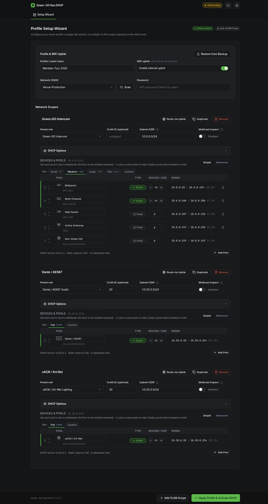

# Setup wizard

The wizard turns a blank appliance into a working DHCP server. What it produces is a profile: the network scopes to serve, the address pools inside each scope, and an optional WiFi uplink. You reach it right after [creating the administrator](first-boot.md), and later again through Edit Configuration when the appliance is active.

## Profile and WiFi uplink

Give the profile an event name you will recognize later ("Tour_A_Arena" beats "Profile 1").

The WiFi uplink is optional: the appliance can join a venue WiFi (scan, pick the SSID, enter the password) and route selected scopes through it for internet access. Each scope has its own Route via Uplink switch, so the intercom network can stay isolated while, say, a production office scope gets out. Leave the uplink off for a fully isolated rig.

## Scopes

A scope is one network the appliance serves: either the single untagged network on eth0, or a tagged VLAN stacked on eth0 as a trunk. Add as many VLAN scopes as the show needs; duplicate an existing scope to clone its settings.

The two badges at the top of the page tell you what the wire actually looks like before you commit: the link badge shows whether eth0 sees untagged traffic, tagged VLANs (with the VLAN IDs it observed) or no cable at all, and the shield badge watches for another DHCP server answering on the wire while you set up. It reads Active while none has answered; if one speaks up, the badge names that server's IP - stop it before applying, or clients will get addresses from both servers. It reads Suspended while the port has no cable, since with no link there is nothing to watch.

Per scope you set:

- **Name** - a label for the scope ("Intercom", "Dante", "Lighting")
- **Preset role** - which kind of network this is; it seeds the pool plan (below)
- **VLAN ID** - leave empty for the untagged network, or set the tag for a trunk scope
- **Subnet CIDR** - the scope's address space; the wizard auto-sizes it to fit the pool plan and widens it if the plan outgrows it
- **Multicast inspect** - off by default; enables a low-rate multicast sample on this scope so the dashboard can show PTP grandmaster and sACN health (see [Network health](network-health.md))

Each scope also has a DHCP options section for the less common knobs: gateway and DNS overrides, a lease-time override, arbitrary extra DHCP options, and the Local DNS switch that hands the appliance out as the scope's DNS server so device names resolve on the network (see [Local DNS](dns.md)).

## Preset roles

The preset seeds the scope's pool plan; everything it produces can be edited afterwards.

**Green-GO Intercom.** The appliance recognizes Green-GO device families automatically and gives each family its own guaranteed pool, sized to the device count you expect (never below a small per-family floor). The two catch-all pools take the elastic remainder: whatever address space the sized pools leave over goes to Green-GO devices without a family pool and to non-Green-GO gear. The result is that an address tells you what kind of device holds it. Size presets (Small, roughly 25 devices; Medium, roughly 120; Large, roughly 300) give you a starting point to adjust.

**Dante / AES67 Audio** and **sACN / Art-Net Lighting.** A single dynamic pool covering the scope. The value of a dedicated scope is isolation and monitoring: the network health detectors know what healthy PTP and sACN traffic look like.

**Custom.** Also a single dynamic pool, with no assumptions. You define your own pools, optionally routed by vendor, in the pool editor.

## The pool plan

Under each scope sits its pool plan: the ordered list of address pools DHCP will serve. The wizard shows the same editor as the Pools page on a running appliance; see [Address pools](pools.md) for how Fixed, Elastic and Reserve pools work and what the two editing modes do.

Every plan keeps the gateway address and a low block of addresses out of DHCP entirely, reserved for equipment with static addresses.

## Starting from a backup

If you have a backup file from another appliance or an earlier setup, Restore from Backup (in the profile card) skips the wizard entirely: accounts, profile and reservations come back in one step. See [Backup, restore and reset](backup-restore.md).

## Applying

Apply Profile & Activate DHCP validates the profile, configures the network interfaces, writes the DHCP configuration and starts serving.

> [!IMPORTANT]
> Applying re-addresses the appliance itself: it moves from its setup address onto the gateway address of your untagged scope (or of the first scope, when every scope is tagged). The browser shows a reconnect page and follows it to the new address automatically; `https://ggo-kea-dhcp.local/` keeps working throughout. Devices on IP fallback need the new address from the [access table](first-boot.md).

If the apply fails, the appliance returns to the setup state and restores the previously active profile, so a failed change never leaves the box half-configured. The reason lands in the [audit log](operating.md).

## Changing the configuration later

On an active appliance, Edit Configuration (in the dashboard's Manage menu) reopens this wizard prefilled with the running profile. Applying replaces the active configuration; the same reconnect behavior applies if you changed subnets or VLANs.

## Next

Read [Address pools](pools.md) to understand and tune the pool plan, or continue to [Day-to-day operation](operating.md).
